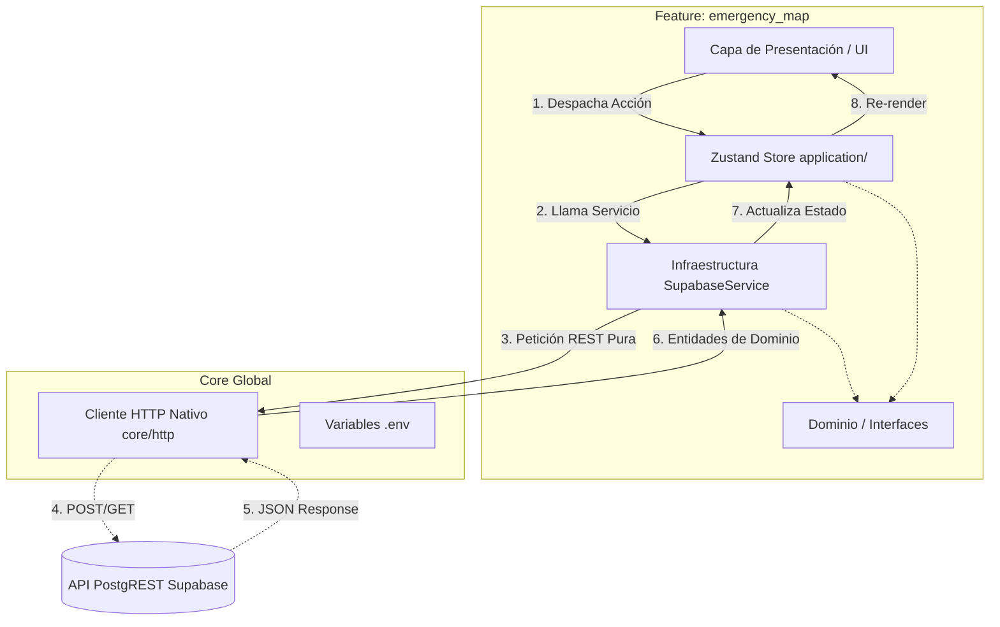

# Documento de Arquitectura de Software
**Módulo:** Integración Backend Supabase y Gestión de Estado
**Fecha:** 2026-08-13
**Autor:** Agente 2 (Staff Software Architect)

## 1. Resumen Ejecutivo
Este documento define la arquitectura técnica para la conexión de la aplicación "GestiónRiesgosManizales" con la infraestructura de Base de Datos en la nube (Supabase). En estricto cumplimiento con el Contrato de Gobernanza, **se ha prohibido el uso del SDK comercial de Supabase**. Toda la capa de integración de red se construirá utilizando estándares nativos de la web (`fetch` API), aplicando el principio de Inversión de Dependencias y Vertical Slicing.

## 2. Diagrama de Componentes (Mermaid)
El flujo de datos sigue un patrón unidireccional y se encapsula dentro del módulo `emergency_map`:

## 3. Registro de Decisiones de Arquitectura (ADR)

### ADR-001: Sustitución de Supabase SDK por HTTP Fetch Nativo
- **Contexto:** Se requiere consumir los datos alojados en Supabase, previniendo el "Vendor Lock-in" comercial y manteniendo un footprint ligero en el frontend.
- **Decisión:** Desarrollar un adaptador genérico en `src/core/http/HttpClient.ts` que implemente la capa de autorización mediante `apikey` y `Authorization Bearer`.
- **Consecuencias (Pro):** Control total sobre las cabeceras HTTP, prevención de dependencias de terceros desactualizadas y menor peso en el bundle final.
- **Consecuencias (Contra):** Incremento en la complejidad de serialización y deserialización manual. Pérdida del soporte nativo de WebSockets (`@supabase/realtime-js`).

### ADR-002: Polling Simulado (Pseudo-Realtime)
- **Contexto:** Necesitamos recibir actualizaciones urgentes, pero sin usar el SDK en tiempo real, los WebSockets son inviables de mantener a nivel raw en tiempo limitado.
- **Decisión:** Implementar una estrategia de **Polling** controlada. El `useEmergencyStore` disparará la función `fetchData` cada 30 segundos utilizando un `setInterval` global.
- **Consecuencias:** Mayor cantidad de peticiones HTTP (overhead), pero asegura una sincronización aceptable para un entorno de emergencia mitigando la carga mediante intervalos controlados (30s).

### ADR-003: Prevención de Automatización (CAPTCHA Nativo)
- **Contexto:** Evitar la saturación del sistema por bots enviando reportes de emergencia falsos.
- **Decisión:** Implementar un CAPTCHA Matemático en la capa de UI. Un generador aleatorio solicitará resolver una operación simple (ej. `2 + 3 = 5`) antes de desbloquear el botón de envío.

### ADR-004: Client-Side Rate Limiting
- **Contexto:** Prevenir el doble envío (Double-submit) debido a la ansiedad o clicks compulsivos del usuario en estado de emergencia.
- **Decisión:** Incorporar bloqueos de estado `isSubmitting` en Zustand y deshabilitar los botones de envío en la UI, acoplado a un `Toast` de confirmación.

### ADR-005: Jerarquía Dinámica de Estados (Triaje)
- **Contexto:** Los administradores y los propios reportantes requieren un control visual del progreso de una emergencia (Reportado -> En Proceso -> Atendido).
- **Decisión:** Integrar mutaciones de estado (`updateReportStatus`) mediante PATCH de Supabase, que a su vez altera la UI y los marcadores de Leaflet de forma cromática (Rojo, Naranja, Verde) y descendente (sort by status).
- **Consecuencias:** Permite un triaje efectivo en el Frontend sin sobrecargar el Backend con lógica de colas. La interfaz se vuelve altamente responsiva, autolimpiando el mapa de emergencias atendidas.
