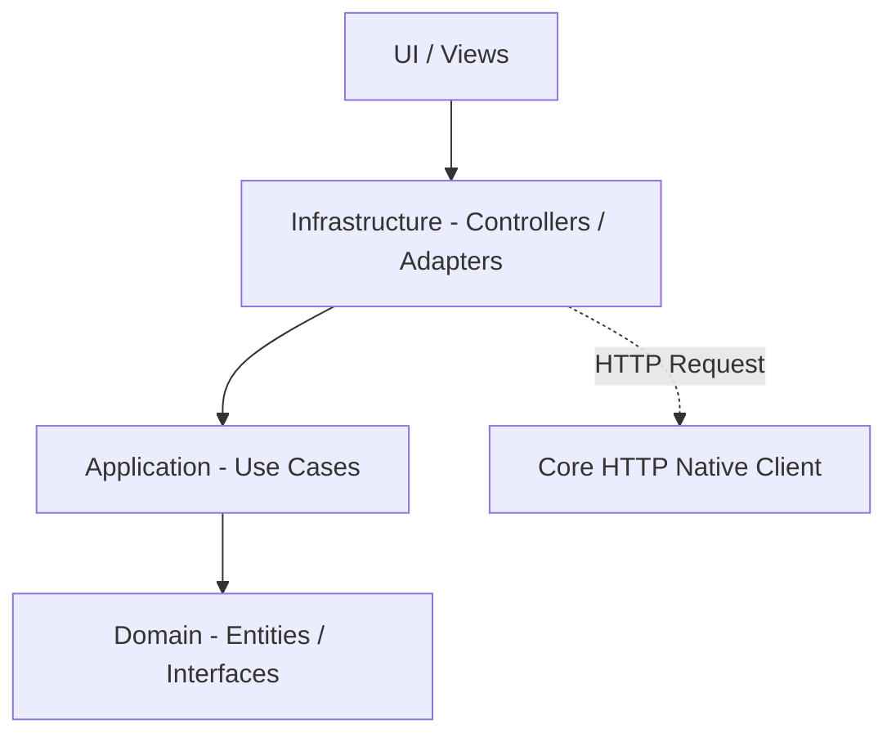

# Documento de Arquitectura
## Resumen Ejecutivo
Este documento describe la arquitectura para el módulo de Gestión de Riesgos (Risk Management). Se utiliza una arquitectura de Rebanadas Verticales (Vertical Slicing), asegurando que todas las responsabilidades (Domain, Application, Infrastructure) relativas a esta feature estén encapsuladas.

## Diagrama de Componentes (Mermaid)

## Registro de Decisiones de Arquitectura (ADR)
- **Patrón de Arquitectura:** Vertical Slicing.
- **Justificación:** Alta cohesión y bajo acoplamiento a nivel de feature. Permite que el módulo sea autónomo.
- **Consecuencias:** Mayor claridad en el mantenimiento por módulo. Prevención de código espagueti.
